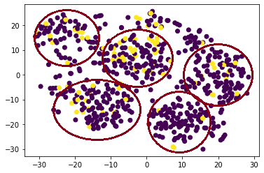
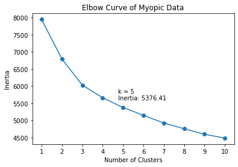

# Myopia Clustering

A reduced [dataset](Resources/myopia.csv) from the US National Eye Institute's Orinda Longitudinal Study of Myopia was explored to determine whether or not it is possible to separate patients into distinct groups. 

## Part 1: Data Preprocessing
After the dataset was imported and read in `Pandas`, the column "MYOPIC" was removed from the data. The remaining metrics were standardized using the `StandardScaler` from the `sklearn` library.

## Part 2: Dimensionality Reduction
### Principal Component Analysis (PCA)
`PCA` from the `sklearn` library reduced the number of dimensions in the standardized data from 14 to 10. These remaining 10 dimensions are sufficient to explain 90% of the variance in the data.

### t-Distributed Stochiastic Neighbor Embedding (t-SNE)
To better visualize the dataset, the PCA-reduced data underwent a t-SNE transformation. `TSNE` from the `sklearn` library further reduced the number of dimnesions from 10 to 2 for ease of visualization. As seen below, these 2 dimensions were plotted against each other to form clusters. 

For clarity, dark red circles were added to distinguish each of the clusters discovered. Points were colored on the basis of myopic versus non-myopic. Based on this t-SNE analysis, we can predict that this dataset can be clustered into 5 groups.

### Part 3: Cluster Analysis
`KMeans` from the `sklearn` library was used to determine the optimal number of clusters for the dataset. Over a range of 1 to 10 possible clusters, a K-Means model was fit for the PCA-transformed data and its inertia was calculated. 

The Elbow Curve above plots the number of clusters against their calculated inertia values. Inertia numerically represents how well the K-Means model clusters the data inputted. To avoid overfitting the model, the optimal number of clusters appears at the "elbow" of the curve, or where the inertia value stops significantly decreasing. For this data, the "elbow" was established as 5 clusters with an inertia of around 5376.41. 

## Part 4: Recommendation
Because the inertia only drops marginally around 5 clusters, as seen in the Elbow Curve, we can reasonably assume that patients can be clustered into 5 groups. 